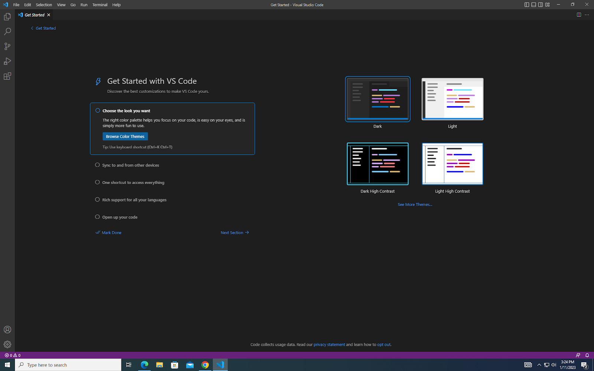

# Remote Access: A Guide
  
Today, we're going to learn how to remotely connect to the UCSD server and test out some commands. The process is actually rather straightforward, and can be
done in half an hour or less. 
  
First, we need to connect to the remote server using shs. To do that, you need your CSE 15L account set up. You can find your account [here](https://sdacs.ucsd.edu/~icc/index.php).
When you enter your name and PID into the lookup, it'll present you with two accounts: your regular UCSD account and the course account that begins with cs15l. Select the latter,
and then change the password by clicking on the "change your password" link. It will take you to the global password change portal, from where you can set your new password
(Note: Don't click the "check password" button, just hit enter when you've made your new password). Now you're ready to log into the remote server.
  
To begin, launch Visual Studio Code (VSCode). If you don't have the app, then just download it [here](https://code.visualstudio.com/download). Your VSCode window should look like this after installation:
  
Next, if you're on Windows and don't have it already, 
download git [here](https://gitforwindows.org/). I did this lab on the lab computers (which had git preinstalled), so I don't have personal experience with this specific step. 
Using the steps outlined [here](https://stackoverflow.com/questions/42606837/how-do-i-use-bash-on-windows-from-the-visual-studio-code-integrated-terminal/50527994#50527994), get Git Bash 
open on VSCode. Now we'll begin the remote login by typing `$ ssh cs15lwi23___@ieng6.ucsd.edu` (replacing the blank spaces with the corresponding letters in your course account).
If it tells you that the authenticity of the host can't be established and asks you whether you want to continue connecting, type in `yes`. Once you successfully input your password,
your screen should look something like this: INSERT IMAGE HERE
  
Now you're ready to try some commands! `cd` allows you to change directory (try going to the parent directory, perhaps) and `cd ~` takes you to the home directory. 
The `ls` command lists the files in your current directory, while modifications like `ls -l` and `ls -lat` provide more information. There are other commands as well, such as `cat` and `cp`, that you can try out. Here is a screenshot of some of what I did:
INSERT IMAGE HERE
  
And that's it! You've successfully logged onto a remote server using shs and executed commands on the computer you're connected to. 
