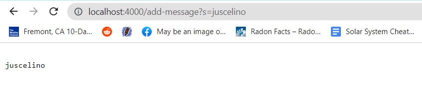
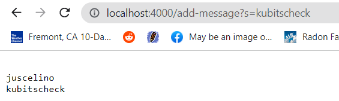
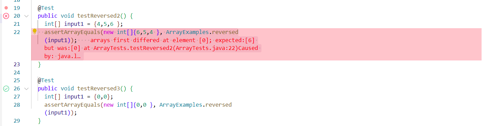

# Servers and Bugs

The code for `StringServer` is as follows:  
```
import java.io.IOException;
import java.net.URI;

class Handler implements URLHandler {
    // The one bit of state on the server: a number that will be manipulated by
    // various requests.
    String currStr = "";

    public String handleRequest(URI url) {
        if (url.getPath().equals("/add-message")) {
           String q = url.getQuery();
           String[] qs = q.split("=");
           if(qs[0].equals("s")){
            try{
                currStr += "\n" + qs[1];
                return currStr;
            }
            catch(Exception e){
                return e.getStackTrace().toString();
            }
                
           }
        }
        return "ERROR";
    }
}

class StringServer {
    public static void main(String[] args) throws IOException {
        if(args.length == 0){
            System.out.println("Missing port number! Try any number between 1024 to 49151");
            return;
        }

        int port = Integer.parseInt(args[0]);

        Server.start(port, new Handler());
    }
}
```  
This server must be compiled with Server.java (the same file as the one used Lab 2) to work properly. Here are some examples of server queries and outputs:  
<br>
  
In this image, I have entered the url `localhost:4000/add-message?s=juscelino` into my web browser. Since my server was launched on port 4000 on localhost, this sends the url to my server. This calls the `handleRequest` method with a parameter of the aforementioned url (packaged as a URI object in Java). The path is then extracted, and since it is `/add-message`, the code proceeds to extract the query (which begins after the `?`). Since valid queries are in the form `s=____`, the query is split using the `=`. If the first part of the query is indeed `s`, then the second part of the query is extracted and concatenated (along with a prepended newline) to the String `currStr`. `currStr` is the String that stores user input in this server, and was initialized to lambda (the empty String) when the server was launched. Finally, the (new) value of currStr is returned and printed on the webpage.  
<br>

<br>
In this image, I have entered the url `localhost:4000/add-message?s=kubitscheck` into my web browser. The same processes occur as outlined in the previous image, with one change: the value of currStr is changed from `\nJuscelino` to `\nJuscelino\nKubitscheck`. `Kubitscheck` is simply concatenated to the String, with a newline before it. The new value of currStr is returned and printed on the webpage.
<br><br><br>

##Bugs

For this section, I will be focusing on the bug in the `reversed` method in the `ArrayExamples` class. <br>
<br>
Failure-inducing input: 
<br>
```
  @Test
  public void testReversed2() {
    int[] input1 = {4,5,6 };
    assertArrayEquals(new int[]{6,5,4 }, ArrayExamples.reversed(input1));
  }
```
<br>
Successful input:
<br>

```
  @Test
  public void testReversed3() {
    int[] input1 = {0,0};
    assertArrayEquals(new int[]{0,0 }, ArrayExamples.reversed(input1));
  }
```

<br>
Symptoms:
<br>

<br>
Buggy method (before):
<br>
```
  static int[] reversed(int[] arr) {
    int[] newArray = new int[arr.length];
    for(int i = 0; i < arr.length; i += 1) {
      arr[i] = newArray[arr.length - i - 1];
    }
    return arr;
  }
```
<br>

Bug fix (after):

<br>
```
  static int[] reversed(int[] arr) {
    int[] newArray = new int[arr.length];
    for(int i = 0; i < arr.length; i += 1) {
      newArray[arr.length - i - 1] = arr[i];
    }
    return newArray;
  }
```
<br>

This fixes the issue because the original code was assigning the elements of the original array based on elements of the (just-instantiated) new array, which is the opposite of how it's supposed to be. The fix was simply swapping the expressions on the two sides of the equal sign (on the line that begins `newArray = ...`). The return statement was changed as well, to return the new array rather than the original.

<br>

I learned quite a bit about servers from this lab. Specifically, I learned that anyone can host a server from their own computer, and even make it publicly accessible through the use of ssh. I'm still not sure exactly how Server.java works, but I expect I'll learn about that later. In addition to this, I was also reminded that a buggy method can have accurate results some of the time, and that a lack of errors does not necessarily mean success (I knew this previously, of course, but it takes some reminding for it to stay in the front of the brain).
