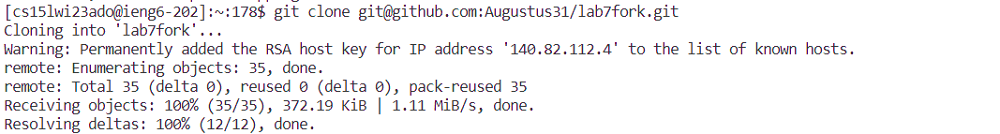
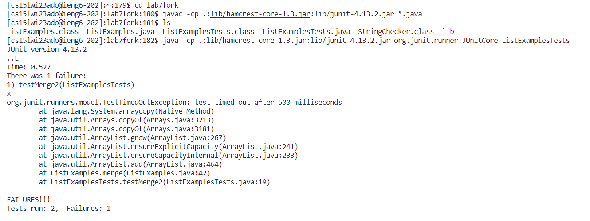
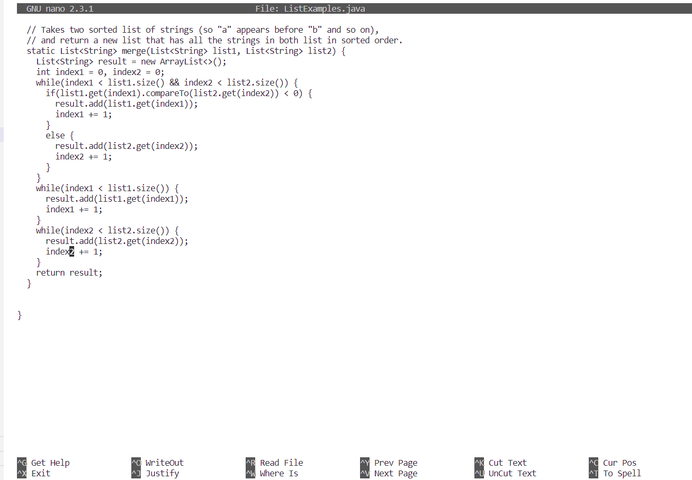
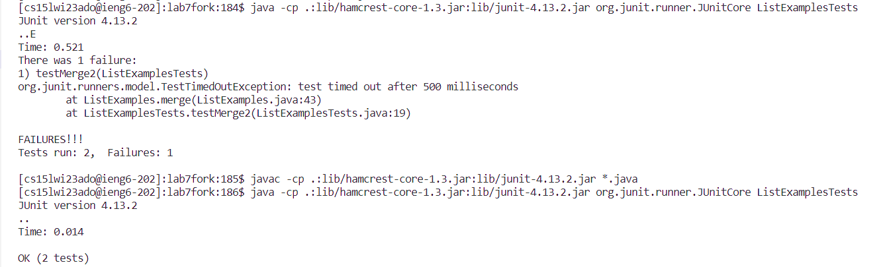
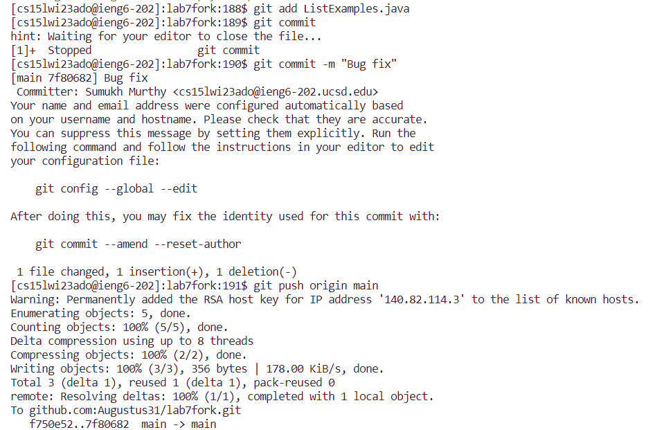

# Lab Report 4: Keylogging git commands

  

This lab report details steps 4-9 as outlined in the Week 7 lab.

 

## Step 4: Logging into ieng6

 

 

In this step, I simply typed out `ssh cs15lwi23ado@ieng6.ucsd.edu` and hit `<enter`. This logged me into the server without asking for the password, since I had already set up my ssh key.

 

## Step 5: Cloning fork of repository

 

 

Here, I copied the ssh clone command from github using `Ctrl-C` and pasted it into the terminal with `Ctrl-V' after typing `git clone `. This successfully cloned the repository that I had already forked from the original.

 

## Step 6: Running the tests

 

 

First, I moved into the repository by typing `cd lab7fork`. Then, I went to the Week 3 page of the CSE 15L website and copied the compilation command (which included the classpaths) using `Ctrl-C`. I then pasted it and ran it on the command line with `Ctrl-V`. I quickly checked if everything had worked as expected using `ls`. Then, I used `Ctrl-C` and `Ctrl-V` to copy the java command with classpaths into the command line. I then modified the end of the command to say ListExamples instead of ArrayTests, and hit `<enter>`. The command ran, showing one failed test.

 

## Step 7: Edit code to fix failed test
  
 

 

To enter the text editor, I typed in `nano ListExamples.java`. I then scanned the file for bugs, until I found it - one line read `index1 += 1` when it should have read `index2 += 1`. I used `Ctrl-W` and typed in `index1 = 1` to try to move the cursor there, but it went to another line further up. So I repeated it once more and it brought the cursor down to the correct line. Then I typed `<right>` 6 times and replaced the 2 with 1. With the error fixed, I typed in `Ctrl-O` and saved the file.
  
 
  
## Step 8: Run the tests again
  
 
  

  
 
  
Initially, I tried to simply run the tests again, but it gave me an error and I realized I needed to compile again. I recompiled ListExamples.java by typing `<up>` five times (to get to the previous command) and then hitting `<enter>`. Then I ran them again using the same technique. The tests were successful.
  
 
  
## Step 9: Push to Github
  
 
  

  
 
  
Here, I did `git add ListExamples.java`, `git commit -m "Bug fix"` (after failing once by forgetting to put a message), and finally `git push origin main`. This successfully committed and pushed the changes to Github. 
