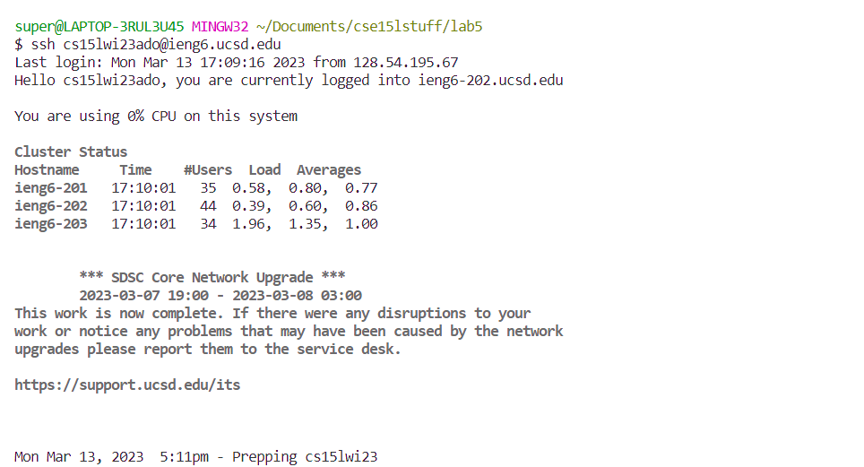
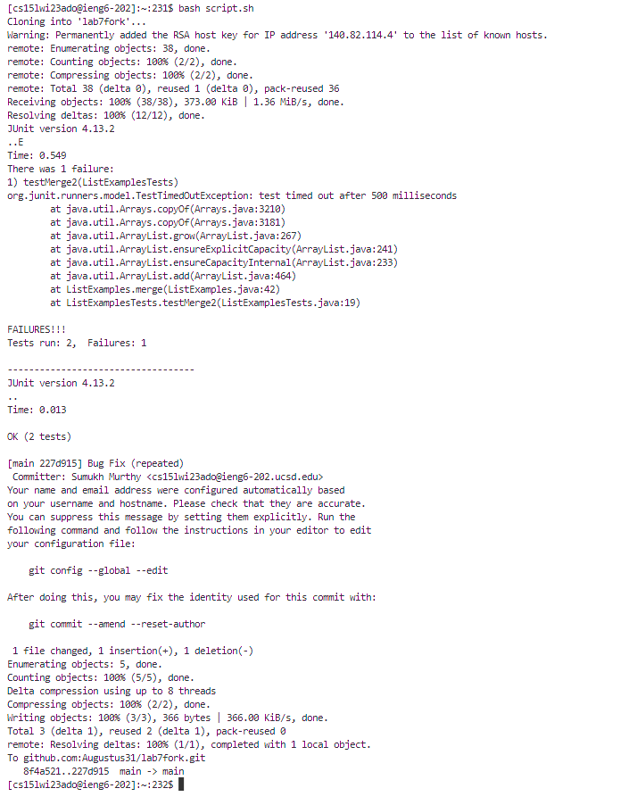

# Lab 4 Revisited: Doing it with Shell Script

In this lab, I will explore how to do the steps of Lab 4 via a bash shell script. 

## The Script

The shell script I've written is as follows:

```
git clone https://github.com/Augustus31/lab7fork.git
cd lab7fork
javac -cp .:lib/hamcrest-core-1.3.jar:lib/junit-4.13.2.jar *.java
java -cp .:lib/hamcrest-core-1.3.jar:lib/junit-4.13.2.jar org.junit.runner.JUnitCore ListExamplesTests
echo '-----------------------------------'
sed -i '43s/index1/index2/' ListExamples.java
javac -cp .:lib/hamcrest-core-1.3.jar:lib/junit-4.13.2.jar *.java
java -cp .:lib/hamcrest-core-1.3.jar:lib/junit-4.13.2.jar org.junit.runner.JUnitCore ListExamplesTests
git add ListExamples.java
git commit -m "Bug Fix (repeated)"
git push origin main
```

This script essentially runs all of the commands I ran by hand in the previous lab. It clones the lab 7 fork with `git clone`, compiles and runs the tests (which fail), and then prints a divider of dashes (which signifies the end of the first run of tests). Then, the `sed` command is used to edit the `ListExamples.java` file. The `-i` flag indicates that the file is being edited in-place, and `43s/index1/index2/` tells the command to replace `index1` with `index2` on line 43. Then, the files are again compiled, the tests are run successfully, and the changes are committed and pushed to Github.

## Running the Script

I wrote this script on my machine, so I used `scp` to transfer it to the remote server. Then, I logged onto the remote server and ran it from there. See the following screenshots for exactly what I did:




